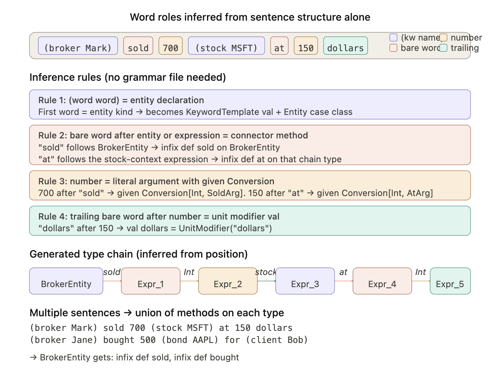
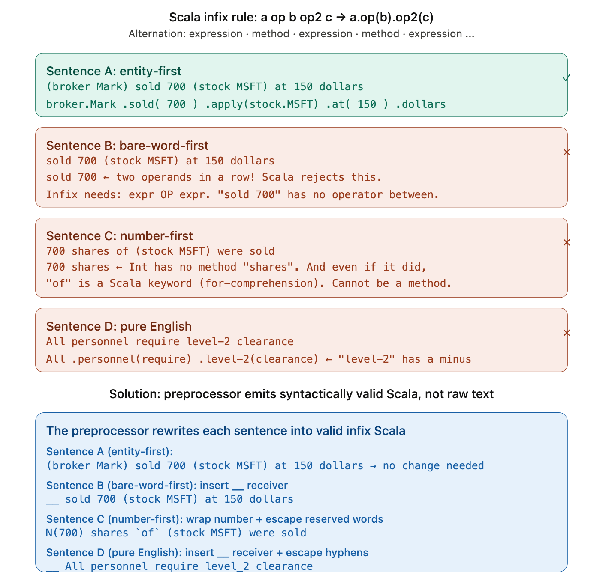

The [DIALS repository](https://github.com/0x1DOCD00D/DIALS) contains the actual implementation pattern in the SlanMachinery source where the actual KeywordTemplate and Dynamic trait implementation resides. The DIALS source shows the exact pattern: `KeywordTemplate` + `Dynamic` trait + fluent infix method chains. Let us now design how this applies to PROFESS's trading sentence and create the architecture where the two-pass preprocessor generates scaffolding. 

**The fundamental shift: sentences as executable code, not parsed strings.**

In the current PROFESS pipeline, `@:- (broker Mark) sold 700 (stock MSFT) at 150 dollars -:@` gets preprocessed into a string literal `FESS("(broker Mark) sold 700 (stock MSFT) at 150 dollars")`, and then a macro parses that string at compile time to build the IR. The DIALS approach eliminates string parsing entirely. Instead, the preprocessor generates scaffolding classes so that after generation, the sentence *is valid Scala* that the compiler resolves through its normal method resolution rules.


**How DIALS does it, and how it maps to your trading sentence.**

In DIALS, `(agent PingAgent)` works because there's a `val agent = new KeywordTemplate(classOf[AgentEntity])` where `KeywordTemplate` extends `Dynamic`. When the compiler sees `agent.PingAgent`, it can't find a member called `PingAgent`, so it rewrites to `agent.selectDynamic("PingAgent")`, which returns an `AgentEntity("PingAgent")`. That `AgentEntity` class has an infix method `has` that takes a block of code and returns a `HasExpr`, which has a method `autotrigger`, and so on. Each method call builds the IR as a side effect.

For our trading sentence, the same pattern applies but the preprocessor must generate the scaffolding automatically. Here's the chain of compiler resolutions for `(broker Mark) sold 700 (stock MSFT) at 150 dollars`:

1. `(broker Mark)` — `broker` is a `KeywordTemplate[BrokerEntity]`. The compiler rewrites `broker.Mark` to `broker.selectDynamic("Mark")`, returning `BrokerEntity("Mark")`.

2. `BrokerEntity("Mark") sold 700` — `BrokerEntity` has `infix def sold(qty: QuantityExpr): SoldExpr`. The `700` is an `Int`, and `given Conversion[Int, QuantityExpr]` fires, so the compiler sees `BrokerEntity("Mark").sold(QuantityExpr(700))`. The `sold` method records `VerbEdge(n1, "sold", n2)` in the IR and returns a `SoldExpr`.

3. `SoldExpr(...) (stock MSFT)` — `SoldExpr` has an `apply` or infix method accepting `StockEntity`. The `(stock MSFT)` resolves the same way as step 1. The method records `QuantityEdge(n2, n3)`.

4. The chain continues through `at` (a method on the expression type) and `150 dollars` (implicit conversion + unit modifier).
   Good call. The grammar file was a crutch. The sentences themselves contain all the information needed to generate scaffolding. The sentences tell us everything. Here's the core realization: **the sentences are the grammar**. The preprocessor doesn't need a separate grammar file because the `(keyword name)` pattern already tells it everything about entity kinds, and the positional ordering of bare words between entities tells it what methods go on which classes. Let me walk through the logic.



**The only structural assumption is that parentheses mean entities.** When the preprocessor sees `(broker Mark)`, the parens are an unambiguous signal: `broker` is an entity kind, `Mark` is a name. This is true in every PROFESS sentence regardless of domain. Everything else — which words are verbs, which are prepositions, which are unit modifiers — is inferred from where they appear relative to entities and numbers.

**Position determines role.** Consider the sentence `(broker Mark) sold 700 (stock MSFT) at 150 dollars`. The preprocessor tokenizes it and sees the following chain.

```
EntityToken("broker","Mark") → BareWord("sold") → Number(700) → EntityToken("stock","MSFT") → BareWord("at") → Number(150) → BareWord("dollars")
```

From this sequence alone: `sold` immediately follows a `broker` entity, so it becomes an `infix def sold` on `BrokerEntity`. The `700` follows `sold`, so the method `sold` takes an `Int` argument (via `given Conversion`). The `(stock MSFT)` follows the number, so the expression type returned by `sold(700)` needs an `apply` that accepts `StockEntity`. The word `at` follows that stock-context expression, so it becomes a method on that chain type. And `dollars` is a bare word after a number at the end of the sentence, so it becomes `val dollars = UnitModifier("dollars")`.

Therefore, the inference algorithm cannot be just anchored on `(keyword name)` being first. But sentences like `sold 700 (stock MSFT) at 150 dollars` or `All personnel require level-2 clearance` or `700 shares of (stock MSFT) were sold` need to work too.

The deeper problem is how Scala parses infix chains. What the compiler actually sees is the position assignment works for every shape.The core insight is that the preprocessor doesn't need to know English grammar. It only needs to know Scala's infix parsing rule: **expressions and methods must alternate**. From that single rule, every word's role is mechanically determined by its position in the chain.

**How position assignment works.** Entities `(kind name)` and numbers are always expressions — they can't be method names. Bare words fill whichever slot comes next in the alternation. So when the preprocessor walks `(broker Mark) sold 700 (stock MSFT) at 150 dollars`, it sees: expression `(broker Mark)`, then the alternation demands a method → `sold` fills it, then expression → `700` fills it, then method needed but `(stock MSFT)` is an expression → two expressions in a row, handled by `.apply()` on the previous result type, then method → `at` fills it, then expression → `150`, then method → `dollars`.

The same logic handles every sentence shape without special cases.

**Sentences starting with bare words** like `sold 700 (stock MSFT)` — the first word `sold` would land in expression position. But the preprocessor detects that if the very next token is also an expression (the number `700`), then `sold` must be a method, not an expression. When the first word needs to be a method, the preprocessor prepends `__` — a synthetic receiver object whose generated class has `sold` as an infix method. The business analyst never sees this; it happens in `src_managed/`.

**Sentences starting with numbers** like `700 shares of (stock MSFT)` — `700` is an expression, `shares` fills the method slot. The scaffolding generator creates an `extension (n: Int) infix def shares` so that `700.shares` works. The word `of` is a Scala reserved word, so the preprocessor backtick-escapes it to `` `of` ``.

**Pure English** like `All personnel require level-2 clearance` — no entities, no numbers. Words just alternate: `All` (expression) `.personnel` (method) `(require)` (expression argument) `.level_2` (method) `(clearance)` (expression argument). The scaffolding generates `val All: WordVal_All` and a chain of expression classes with the right methods. The hyphen in `level-2` gets replaced with an underscore.

**Three things the preprocessor does to any sentence:**

1. **Tokenizes** — finds `(kind name)` entities, numbers, and bare words.
2. **Assigns positions** — alternates expr/method slots, resolving conflicts when two expressions collide (entities or numbers force `.apply()` on the predecessor).
3. **Normalizes syntax** — prepends `__` if needed, backtick-escapes reserved words, replaces hyphens, wraps problematic number positions in parens.

**What gets generated** is driven entirely by which words land in which positions across all sentences in the project. If `sold` appears in method position on `BrokerEntity` in one sentence and on `SentenceContext` (`__`) in another, both classes get an `infix def sold`. If `clearance` appears in expression position, it gets a `val clearance: WordVal_clearance`. No grammar file, no vocabulary configuration. The sentences define their own structure.

**Multiple sentences build a richer picture.** If a second sentence says `(broker Jane) bought 500 (bond AAPL) for (client Bob)`, the preprocessor unions the patterns: `BrokerEntity` now gets both `sold` and `bought` as infix methods, `bond` and `client` become new entity kinds with their own `KeywordTemplate` vals, and `for` becomes a method on the expression chain after the bond context.

**The preprocessor runs on every compile.** Since it's an SBT `sourceGenerator`, it scans all `@:-` blocks project-wide before compilation. If a business analyst adds a new sentence with a new verb or entity kind, the next compile regenerates the scaffolding automatically. The analyst doesn't configure anything — they just write English and hit compile.

**What changes from the previous architecture.** The preprocessor's job shifts dramatically. Previously it wrapped sentences in `FESS("...")` strings. Now it does two things: (1) generates scaffolding classes to `src_managed/`, and (2) strips the `@:-` / `-:@` markers from the source files so the bare sentence is valid Scala. After this, the sentence compiles through normal Scala method resolution — `selectDynamic` for entities, infix methods for verbs and prepositions, `given Conversion` for numbers.

**The software engineer's interface stays clean.** They see the IR that the executed sentences produce and write handlers as `given` instances. They never touch the scaffolding. Their code looks like this:

```scala
given tradingHandlers: HandlerRegistry[IO, Trade] =
  HandlerDSL.handlers[IO, Trade]
    .onEntity("broker") { (name, ctx) => IO.pure(Trade(broker = Some(Broker(name)))) }
    .onVerb("sold") { (args, ctx) => IO.pure(Trade(action = Some(Sell))) }
    .onEntity("stock") { (name, ctx) => IO.pure(Trade(stock = Some(Ticker(name)))) }
    .build
```

The handler keys (`"broker"`, `"sold"`, `"stock"`) are just the words from the sentences. The software engineer reads the sentences the analyst wrote and provides executable meaning for each word.

**One edge case to handle: the first compile.** When an analyst writes a completely new sentence with entity kinds that don't exist yet, the first compile will fail because the scaffolding hasn't been generated. The fix is standard SBT multi-pass: the `sourceGenerator` runs first (generating scaffolding), then compilation runs against the combined original + generated sources. SBT already supports this workflow — `sourceGenerators` output goes to `src_managed/` which is on the compile classpath automatically.

```scala 3
// ═══════════════════════════════════════════════════════════════════════
// PROFESS Universal Sentence Normalizer
//
// The business analyst writes ANY English sentence inside @:- ... -:@.
// The preprocessor's job is to:
//   1. Ensure it becomes syntactically valid Scala (infix chain)
//   2. Generate scaffolding classes so every word resolves
//
// The Scala infix rule: a op b op2 c → a.op(b).op2(c)
// This means the sentence must alternate: EXPR OP EXPR OP EXPR ...
// where OPs are identifiers (method names) and EXPRs are values.
//
// The normalizer fixes sentences that violate this alternation.
// ═══════════════════════════════════════════════════════════════════════


// ─────────────────────────────────────────────────────────────────────
// THE PROBLEM: WHY RAW SENTENCES DON'T ALWAYS PARSE
//
// Scala infix: a b c d e f g → a.b(c).d(e).f(g)
//   position:  E M E M E M E   (E=expression, M=method)
//
// (broker Mark) sold 700 (stock MSFT) at 150 dollars
//     E          M   E      E?        M   E    M
//                         ↑ two expressions in a row!
//
// The compiler resolves (stock MSFT) after sold(700) via .apply()
// because the result of sold(700) can have def apply(s: StockEntity).
// This works. But other patterns don't:
//
// sold 700 (stock MSFT) at 150 dollars
//  E   E?  ← Two expressions at start! "sold 700" is not infix.
//
// The fix: ensure every sentence starts with a valid EXPR METHOD pair.
// ─────────────────────────────────────────────────────────────────────


// ─────────────────────────────────────────────────────────────────────
// DESIGN PRINCIPLE: TWO KINDS OF WORDS
//
// In ANY English sentence used as Scala infix, every word is either:
//   (a) an EXPRESSION (entity, number, result of a method call)
//   (b) a METHOD name (identifier in odd position of the chain)
//
// The preprocessor determines which is which by a simple rule:
//   - (keyword name) groups are always EXPRESSIONS
//   - Numbers are always EXPRESSIONS
//   - Bare words ALTERNATE between METHOD and EXPRESSION positions
//   - The first bare word's role depends on what precedes it
//
// The critical insight: the preprocessor doesn't need to know if
// "sold" is a verb or "at" is a preposition. It only needs to know
// whether each word is in METHOD position or EXPRESSION position
// in the Scala infix chain.
// ─────────────────────────────────────────────────────────────────────


// Scala reserved words that cannot be identifiers without backticks
val scalaReserved = Set(
  "abstract", "case", "catch", "class", "def", "do", "else",
  "extends", "false", "final", "finally", "for", "forSome",
  "if", "implicit", "import", "lazy", "match", "new", "null",
  "object", "override", "package", "private", "protected",
  "return", "sealed", "super", "this", "throw", "trait",
  "true", "try", "type", "val", "var", "while", "with", "yield",
  // Soft keywords that may cause issues in certain positions:
  "given", "using", "then", "enum", "export", "end"
)


sealed trait SentenceToken:
  def originalText: String

case class EntityGroup(kind: String, name: String) extends SentenceToken:
  def originalText = s"($kind $name)"

case class NumericLit(value: String) extends SentenceToken:
  def originalText = value

case class Word(text: String) extends SentenceToken:
  def originalText = text


// ─────────────────────────────────────────────────────────────────────
// STEP 1: TOKENIZE THE RAW SENTENCE
// ─────────────────────────────────────────────────────────────────────

def tokenize(sentence: String): List[SentenceToken] =
  val entityPattern = """\(\s*(\w+)\s+(\w+)\s*\)""".r
  val result = scala.collection.mutable.ListBuffer[SentenceToken]()

  // Find all entity groups with their positions
  val entities = entityPattern.findAllMatchIn(sentence).toList

  var pos = 0
  for m <- entities do
    // Words between previous position and this entity
    val gap = sentence.substring(pos, m.start).trim
    if gap.nonEmpty then
      for w <- gap.split("\\s+") if w.nonEmpty do
        if w.matches("-?\\d+(\\.\\d+)?") then result += NumericLit(w)
        else result += Word(w)
    result += EntityGroup(m.group(1), m.group(2))
    pos = m.end

  // Trailing words after last entity
  val trailing = sentence.substring(pos).trim
  if trailing.nonEmpty then
    for w <- trailing.split("\\s+") if w.nonEmpty do
      if w.matches("-?\\d+(\\.\\d+)?") then result += NumericLit(w)
      else result += Word(w)

  result.toList


// ─────────────────────────────────────────────────────────────────────
// STEP 2: ASSIGN INFIX POSITIONS
//
// In Scala infix: positions alternate EXPR, METHOD, EXPR, METHOD, ...
//
// Rules:
//   - EntityGroup is ALWAYS an expression (never a method name)
//   - NumericLit is ALWAYS an expression
//   - Word can be either, determined by what position it lands in
//
// When two expressions land in a row, the normalizer must fix it.
// ─────────────────────────────────────────────────────────────────────

sealed trait InfixRole
case object ExprRole extends InfixRole    // value / receiver / argument
case object MethodRole extends InfixRole  // identifier in method position

case class PositionedToken(
  token: SentenceToken,
  naturalRole: InfixRole,  // what the token naturally wants to be
  assignedRole: InfixRole  // what position it ends up in
)

def assignPositions(tokens: List[SentenceToken]): List[PositionedToken] =
  // Determine natural role of each token
  val naturals: List[(SentenceToken, InfixRole)] = tokens.map {
    case e: EntityGroup => (e, ExprRole)   // entities are always expressions
    case n: NumericLit  => (n, ExprRole)   // numbers are always expressions
    case w: Word        => (w, MethodRole) // words default to method position
    // (words CAN be expressions too, but method is the default
    //  because in English: "Mark sold 700" → Mark.sold(700))
  }

  // Now walk the list and assign actual infix positions.
  // The infix chain alternates: EXPR METHOD EXPR METHOD ...
  // We track what position we expect next.
  val result = scala.collection.mutable.ListBuffer[PositionedToken]()
  var expectExpr = true // start expecting an expression

  for (token, natural) <- naturals do
    if expectExpr then
      // We need an expression here
      result += PositionedToken(token, natural, ExprRole)
      expectExpr = false // next should be a method
    else
      // We need a method here
      if natural == MethodRole then
        // Perfect: bare word in method position
        result += PositionedToken(token, natural, MethodRole)
        expectExpr = true // next should be an expression
      else
        // Conflict: entity or number in method position.
        // This means two expressions in a row.
        // Resolution: the previous expr's type gets .apply()
        // to accept this expr as an argument. No method between them.
        // We keep this as an expression and DON'T flip expectExpr.
        result += PositionedToken(token, natural, ExprRole)
        // expectExpr stays false — we still need a method next
        // But actually after .apply(thisExpr), we're back to
        // having a result, so next should be a method.
        // Let's set expectExpr = false (next = method).
        expectExpr = false

  result.toList


// ─────────────────────────────────────────────────────────────────────
// STEP 3: NORMALIZE THE SENTENCE INTO VALID SCALA
//
// Based on the position assignments, emit syntactically valid Scala.
//
// Fixups needed:
//   a) If sentence starts with a method-role word → prepend __ receiver
//   b) If two expressions are adjacent → the first gets .apply(second)
//   c) Reserved words in method position → backtick escape
//   d) Hyphens in identifiers → replace with underscores
//   e) Numbers at start → wrap in N() helper
// ─────────────────────────────────────────────────────────────────────

def normalize(positioned: List[PositionedToken]): String =
  if positioned.isEmpty then return ""

  val sb = new StringBuilder
  var prevRole: InfixRole = null
  var isFirst = true

  for pt <- positioned do
    val tok = pt.token
    val role = pt.assignedRole

    // Check if we need to fix the start
    if isFirst then
      role match
        case ExprRole =>
          // Fine: expression at start
          sb ++= emitExpr(tok)
        case MethodRole =>
          // Problem: method at start has no receiver
          // Fix: prepend a synthetic receiver
          sb ++= "__ "
          sb ++= emitMethod(tok)
      isFirst = false
      prevRole = role

    else
      (prevRole, role) match
        case (ExprRole, MethodRole) =>
          // Normal: expr METHOD → emit " method"
          sb ++= " "
          sb ++= emitMethod(tok)

        case (MethodRole, ExprRole) =>
          // Normal: method EXPR → emit " expr" (argument to method)
          sb ++= " "
          sb ++= emitExpr(tok)

        case (ExprRole, ExprRole) =>
          // Two expressions in a row!
          // The first expr's result type needs .apply(second)
          // In Scala: `result (nextExpr)` works if result has apply.
          // But `result 700` does NOT work (number is not in parens).
          // Fix: wrap the second expr in parens if it's a number.
          tok match
            case _: NumericLit =>
              sb ++= s"(${emitExpr(tok)})"
            case _ =>
              sb ++= " "
              sb ++= emitExpr(tok)

        case (MethodRole, MethodRole) =>
          // Two methods in a row: "sold at" without argument between.
          // This means the first method takes no arguments.
          // In Scala: expr.sold.at is valid (two no-arg method calls).
          // But we're in infix notation... "result sold at 150"
          // would be parsed as result.sold(at).???(150).
          // Fix: make the first one a no-arg call: result.sold at 150
          // The preprocessor should emit "result.sold at 150"
          // But we're building a flat string, so we use dot notation
          // for the first method.
          // Actually, this means the PREVIOUS method should have been
          // emitted with dot notation, not infix. We need lookahead.
          // Simplification: just emit it and let the scaffolding
          // generator create a compatible type chain.
          sb ++= " "
          sb ++= emitMethod(tok)

      prevRole = role

  sb.toString


def emitExpr(tok: SentenceToken): String = tok match
  case EntityGroup(kind, name) => s"($kind $name)"
  case NumericLit(v)           => v
  case Word(text)              =>
    val cleaned = text.replace("-", "_")
    if scalaReserved.contains(cleaned) then s"`$cleaned`"
    else cleaned

def emitMethod(tok: SentenceToken): String = tok match
  case Word(text) =>
    val cleaned = text.replace("-", "_")
    if scalaReserved.contains(cleaned) then s"`$cleaned`"
    else cleaned
  case other =>
    // Shouldn't happen: entities/numbers shouldn't be in method position
    emitExpr(other)


// ─────────────────────────────────────────────────────────────────────
// STEP 4: THE SCAFFOLDING GENERATOR (UPDATED)
//
// Now works with the positioned tokens to generate scaffolding
// that handles any sentence shape.
//
// Key changes from the entity-first version:
//   - Generates `val __` synthetic receiver for bare-word-first sentences
//   - Every entity kind gets a KeywordTemplate (unchanged)
//   - Words in METHOD position → infix methods on predecessor's type
//   - Words in EXPR position (bare words as arguments) → vals in scope
//   - The type chain is built from the position sequence, not from
//     assumptions about entity-first ordering
// ─────────────────────────────────────────────────────────────────────

case class ChainLink(
  position: Int,
  role: InfixRole,
  token: SentenceToken,
  // The type this link produces (for method: return type; for expr: its type)
  producedType: String
)

def buildTypeChain(positioned: List[PositionedToken]): List[ChainLink] =
  val links = scala.collection.mutable.ListBuffer[ChainLink]()
  var currentType = "Unit" // will be overwritten by first expr
  var chainIdx = 0

  // Check if we prepended a __ receiver
  val needsReceiver = positioned.headOption.exists(_.assignedRole == MethodRole)
  if needsReceiver then
    currentType = "SentenceContext"
    links += ChainLink(0, ExprRole, Word("__"), "SentenceContext")
    chainIdx = 1

  for pt <- positioned do
    val typeName = pt.token match
      case EntityGroup(kind, _) => s"${kind.capitalize}Entity"
      case NumericLit(_)        => "Int"
      case Word(text)           =>
        pt.assignedRole match
          case MethodRole =>
            // Method on currentType → returns a new chain type
            chainIdx += 1
            s"Chain_${text}_$chainIdx"
          case ExprRole =>
            // Bare word as expression → needs a val
            chainIdx += 1
            s"WordVal_${text}"

    links += ChainLink(chainIdx, pt.assignedRole, pt.token, typeName)
    currentType = typeName

  links.toList


// ─────────────────────────────────────────────────────────────────────
// STEP 5: GENERATE SCAFFOLDING FROM ALL SENTENCES
//
// Collects type chains from every sentence in the project.
// Unions the entity kinds, method signatures, and expression types.
// Generates one unified scaffolding file.
// ─────────────────────────────────────────────────────────────────────

case class MethodSpec(
  onType: String,     // the type this method is defined on
  methodName: String, // the identifier
  argType: String,    // what the next expression's type is
  returnType: String  // what this method returns
)

case class UnifiedScaffolding(
  entityKinds: Set[String],
  entityNames: Map[String, Set[String]],
  methods: List[MethodSpec],
  applySpecs: List[(String, String, String)], // (onType, argType, returnType)
  bareWordVals: Set[String],
  needsSentenceContext: Boolean
)

def collectScaffolding(
  allSentences: List[String]
): UnifiedScaffolding =
  val entityKinds = scala.collection.mutable.Set[String]()
  val entityNames = scala.collection.mutable.Map[String, scala.collection.mutable.Set[String]]()
  val methods = scala.collection.mutable.ListBuffer[MethodSpec]()
  val applySpecs = scala.collection.mutable.ListBuffer[(String, String, String)]()
  val bareWordVals = scala.collection.mutable.Set[String]()
  var needsCtx = false

  for sentence <- allSentences do
    val tokens = tokenize(sentence)
    val positioned = assignPositions(tokens)
    val chain = buildTypeChain(positioned)

    // Check if this sentence needs __ receiver
    if positioned.headOption.exists(_.assignedRole == MethodRole) then
      needsCtx = true

    // Collect entity kinds and names
    tokens.foreach {
      case EntityGroup(kind, name) =>
        entityKinds += kind
        entityNames.getOrElseUpdate(kind, scala.collection.mutable.Set()) += name
      case _ =>
    }

    // Walk the chain pairwise to build method specs
    for i <- 0 until chain.length - 1 do
      val current = chain(i)
      val next = chain(i + 1)

      next.role match
        case MethodRole =>
          // next is a method on current's produced type
          // But we need the argument type too (the token AFTER next)
          val argType = if i + 2 < chain.length then chain(i + 2).producedType else "Unit"
          val returnType = next.producedType
          next.token match
            case Word(text) =>
              methods += MethodSpec(current.producedType, text, argType, returnType)
            case _ =>

        case ExprRole =>
          if current.role == ExprRole then
            // Two exprs in a row → need .apply on current's type
            applySpecs += ((current.producedType, next.producedType, s"${current.producedType}_${next.producedType}"))

          // If the expr is a bare word, it needs a val
          next.token match
            case Word(text) if next.role == ExprRole =>
              bareWordVals += text
            case _ =>

  UnifiedScaffolding(
    entityKinds.toSet,
    entityNames.map((k, v) => k -> v.toSet).toMap,
    methods.toList.distinctBy(m => (m.onType, m.methodName)),
    applySpecs.toList.distinct,
    bareWordVals.toSet,
    needsCtx
  )


def generateCode(scaffolding: UnifiedScaffolding): String =
  val sb = new StringBuilder

  sb ++= """// ═══ AUTO-GENERATED BY PROFESS ═══
// Regenerated on every compile. Do not edit.
package profess.generated

import scala.language.dynamics
import scala.language.implicitConversions
import profess.runtime.*

// ── Base traits ──
sealed trait ProfessEntity:
  def toNode: GraphNode

trait ChainExpr:
  def toNode: GraphNode

"""

  // ── KeywordTemplate ──
  sb ++= """class KeywordTemplate[T <: ProfessEntity](
  factory: String => T
) extends Dynamic:
  infix def selectDynamic(name: String): T = factory(name)

"""

  // ── Sentence context (for bare-word-first sentences) ──
  if scaffolding.needsSentenceContext then
    val ctxMethods = scaffolding.methods.filter(_.onType == "SentenceContext")
    sb ++= "object __ extends ChainExpr:\n"
    sb ++= "  def toNode: GraphNode = SentenceRoot(IR.nextId())\n"
    for m <- ctxMethods do
      val cleanName = if scalaReserved.contains(m.methodName) then s"`${m.methodName}`" else m.methodName
      sb ++= s"  infix def $cleanName(arg: ${m.argType} | Int | Double | ProfessEntity): ${m.returnType} =\n"
      sb ++= s"    IR.record(ConnectorEdge(this.toNode.id, \"${m.methodName}\", IR.nextId()))\n"
      sb ++= s"    ${m.returnType}(this, arg)\n"
    sb ++= "\n"

  // ── Entity case classes ──
  for kind <- scaffolding.entityKinds do
    val className = s"${kind.capitalize}Entity"
    val entityMethods = scaffolding.methods.filter(_.onType == className)
    val entityApplies = scaffolding.applySpecs.filter(_._1 == className)

    sb ++= s"case class $className(name: String) extends ProfessEntity:\n"
    sb ++= s"  def toNode: GraphNode = EntityNode(IR.nextId(), \"$kind\", name)\n"

    for m <- entityMethods do
      val cleanName = if scalaReserved.contains(m.methodName) then s"`${m.methodName}`" else m.methodName
      sb ++= s"  infix def $cleanName(arg: ${m.argType} | Int | Double | ProfessEntity): ${m.returnType} =\n"
      sb ++= s"    IR.record(ConnectorEdge(this.toNode.id, \"${m.methodName}\", IR.nextId()))\n"
      sb ++= s"    ${m.returnType}(this, arg)\n"

    for (_, argType, retType) <- entityApplies do
      sb ++= s"  def apply(arg: $argType): $retType =\n"
      sb ++= s"    IR.record(ApplyEdge(this.toNode.id, arg match { case e: ProfessEntity => e.toNode.id; case _ => IR.nextId() }))\n"
      sb ++= s"    $retType(this, arg)\n"

    sb ++= "\n"

  // ── KeywordTemplate vals ──
  for kind <- scaffolding.entityKinds do
    val className = s"${kind.capitalize}Entity"
    sb ++= s"val $kind = new KeywordTemplate[$className](name => $className(name))\n"
  sb ++= "\n"

  // ── Chain expression classes ──
  val allChainTypes = scaffolding.methods.map(_.returnType).toSet ++
    scaffolding.applySpecs.map(_._3).toSet

  for chainType <- allChainTypes do
    val chainMethods = scaffolding.methods.filter(_.onType == chainType)
    val chainApplies = scaffolding.applySpecs.filter(_._1 == chainType)

    sb ++= s"case class $chainType(parent: Any, arg: Any) extends ChainExpr:\n"
    sb ++= s"  def toNode: GraphNode = CompositeNode(IR.nextId(), \"$chainType\", Nil)\n"

    for m <- chainMethods do
      val cleanName = if scalaReserved.contains(m.methodName) then s"`${m.methodName}`" else m.methodName
      sb ++= s"  infix def $cleanName(arg: ${m.argType} | Int | Double | ProfessEntity): ${m.returnType} =\n"
      sb ++= s"    IR.record(ConnectorEdge(this.toNode.id, \"${m.methodName}\", IR.nextId()))\n"
      sb ++= s"    ${m.returnType}(this, arg)\n"

    for (_, argType, retType) <- chainApplies do
      sb ++= s"  def apply(arg: $argType): $retType =\n"
      sb ++= s"    IR.record(ApplyEdge(this.toNode.id, IR.nextId()))\n"
      sb ++= s"    $retType(this, arg)\n"

    sb ++= "\n"

  // ── Bare word vals (words used as expressions, not methods) ──
  for word <- scaffolding.bareWordVals do
    val cleaned = word.replace("-", "_")
    val escapedName = if scalaReserved.contains(cleaned) then s"`$cleaned`" else cleaned
    sb ++= s"val $escapedName: WordVal_$cleaned = WordVal_$cleaned(\"$word\")\n"

  sb ++= "\n"

  // ── WordVal types ──
  for word <- scaffolding.bareWordVals do
    val cleaned = word.replace("-", "_")
    val typeName = s"WordVal_$cleaned"
    val wordMethods = scaffolding.methods.filter(_.onType == typeName)

    sb ++= s"case class $typeName(word: String) extends ChainExpr:\n"
    sb ++= s"  def toNode: GraphNode = WordNode(IR.nextId(), word)\n"
    for m <- wordMethods do
      val cleanName = if scalaReserved.contains(m.methodName) then s"`${m.methodName}`" else m.methodName
      sb ++= s"  infix def $cleanName(arg: ${m.argType} | Int | Double | ProfessEntity): ${m.returnType} =\n"
      sb ++= s"    IR.record(ConnectorEdge(this.toNode.id, \"${m.methodName}\", IR.nextId()))\n"
      sb ++= s"    ${m.returnType}(this, arg)\n"
    sb ++= "\n"

  // ── given Conversions for Int at every position that expects it ──
  sb ++= "// Numeric conversions\n"
  sb ++= "given Conversion[Int, ProfessEntity] = n => NumericEntity(n)\n"
  sb ++= "given Conversion[Double, ProfessEntity] = n => NumericEntity(n.toInt)\n"
  sb ++= "case class NumericEntity(value: Int) extends ProfessEntity:\n"
  sb ++= "  def toNode: GraphNode = ValueNode(IR.nextId(), Left(value.toDouble))\n"

  // Add extension method for Int to support `700 shares` pattern
  sb ++= "\n// Extension for number-first patterns like '700 shares'\n"
  sb ++= "extension (n: Int)\n"
  for kind <- scaffolding.entityKinds do
    // Allow 700 (stock MSFT) pattern
    ()
  for word <- scaffolding.bareWordVals do
    val cleaned = word.replace("-", "_")
    val escapedName = if scalaReserved.contains(cleaned) then s"`$cleaned`" else cleaned
    sb ++= s"  infix def $escapedName: Chain_${cleaned}_num = \n"
    sb ++= s"    IR.record(ValueEdge(IR.nextId(), n))\n"
    sb ++= s"    Chain_${cleaned}_num(NumericEntity(n), WordVal_$cleaned(\"$word\"))\n"
  sb ++= "\n"

  sb ++= "// ═══ END AUTO-GENERATED ═══\n"
  sb.toString


// ─────────────────────────────────────────────────────────────────────
// COMPLETE PIPELINE: from raw @:- blocks to compiled sentences
// ─────────────────────────────────────────────────────────────────────

def processProject(sourceDir: java.io.File, outputDir: java.io.File): Seq[java.io.File] =
  val scalaFiles = sourceDir.listFiles().filter(_.getName.endsWith(".scala"))

  // ── Phase A: Extract all sentences ──
  val sentencesByFile = scala.collection.mutable.Map[java.io.File, List[(Int, Int, String)]]()
  val allSentences = scala.collection.mutable.ListBuffer[String]()

  for file <- scalaFiles do
    val content = scala.io.Source.fromFile(file).mkString
    val markers = scala.collection.mutable.ListBuffer[(Int, Int, String)]()
    var pos = 0
    while
      val startIdx = content.indexOf("@:-", pos)
      if startIdx >= 0 then
        val endIdx = content.indexOf("-:@", startIdx + 3)
        if endIdx >= 0 then
          val sentence = content.substring(startIdx + 3, endIdx).trim
          markers += ((startIdx, endIdx + 3, sentence))
          allSentences += sentence
          pos = endIdx + 3
          true
        else { pos = content.length; false }
      else { pos = content.length; false }
    do ()
    if markers.nonEmpty then
      sentencesByFile(file) = markers.toList

  // ── Phase B: Build unified scaffolding ──
  val scaffolding = collectScaffolding(allSentences.toList)
  val generatedCode = generateCode(scaffolding)

  val scaffoldFile = new java.io.File(outputDir, "profess/generated/Scaffolding.scala")
  scaffoldFile.getParentFile.mkdirs()
  java.nio.file.Files.writeString(scaffoldFile.toPath, generatedCode)

  // ── Phase C: Rewrite source files ──
  // Replace each @:- sentence -:@ with the normalized Scala version
  val rewrittenFiles = scalaFiles.flatMap { file =>
    sentencesByFile.get(file).map { markers =>
      val content = scala.io.Source.fromFile(file).mkString
      var rewritten = content

      // Process markers in reverse order (so positions don't shift)
      for (startIdx, endIdx, sentence) <- markers.reverse do
        val tokens = tokenize(sentence)
        val positioned = assignPositions(tokens)
        val normalized = normalize(positioned)
        rewritten = rewritten.substring(0, startIdx) + normalized + rewritten.substring(endIdx)

      // Add import for generated scaffolding
      if !rewritten.contains("import profess.generated.*") then
        rewritten = rewritten.replaceFirst(
          "(package [\\w.]+)",
          "$1\nimport profess.generated.*"
        )

      val outFile = new java.io.File(outputDir, file.getName)
      java.nio.file.Files.writeString(outFile.toPath, rewritten)
      Some(outFile)
    }
  }.flatten

  rewrittenFiles.toSeq :+ scaffoldFile


// ─────────────────────────────────────────────────────────────────────
// EXAMPLES: How each sentence shape gets processed
// ─────────────────────────────────────────────────────────────────────

/*
SENTENCE A (entity-first):
  Input:  (broker Mark) sold 700 (stock MSFT) at 150 dollars
  Tokens: Entity(broker,Mark) Word(sold) Num(700) Entity(stock,MSFT) Word(at) Num(150) Word(dollars)
  Positions: E M E E M E M
                      ↑ two exprs: sold(700).apply(stock.MSFT)
  Normalized: (broker Mark) sold 700 (stock MSFT) at 150 dollars
  (No change needed — Scala handles the .apply() naturally)

SENTENCE B (bare-word-first):
  Input:  sold 700 (stock MSFT) at 150 dollars
  Tokens: Word(sold) Num(700) Entity(stock,MSFT) Word(at) Num(150) Word(dollars)
  Positions: M E E M E M
             ↑ starts with method! Needs receiver.
  Normalized: __ sold 700 (stock MSFT) at 150 dollars
  Generated:  object __ with: infix def sold(...)

SENTENCE C (number-first):
  Input:  700 shares of (stock MSFT) were sold
  Tokens: Num(700) Word(shares) Word(of) Entity(stock,MSFT) Word(were) Word(sold)
  Positions: E M E? E M M
  Normalized: 700 shares `of` (stock MSFT) were sold
  Generated:  extension (n: Int) infix def shares: ...
              + backtick escape for "of"

SENTENCE D (pure English):
  Input:  All personnel require level-2 clearance
  Tokens: Word(All) Word(personnel) Word(require) Word(level-2) Word(clearance)
  Positions: E M E M E
  Normalized: All personnel require level_2 clearance
  Generated:  val All: WordVal_All with method "personnel"
              Chain type with method "require"
              val level_2, val clearance

SENTENCE E (entity in middle only):
  Input:  sell immediately (stock MSFT) at market price
  Tokens: Word(sell) Word(immediately) Entity(stock,MSFT) Word(at) Word(market) Word(price)
  Positions: M M E M E M
             ↑ starts with method
  Normalized: __ sell immediately (stock MSFT) at market price
  Generated:  object __ with method "sell"
              Chain with no-arg method "immediately"
              Then entity argument, etc.
*/
```